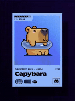

# 💫 About Me:
Hi there, I’m **Shaun Thomas**! 👋   I’m a Computer Science major at California Baptist University and have been programming since my freshman year of high school.  A little about me:   - I have a strong background in **web development**, working on both frontend and backend projects.   - Lately, I’ve been exploring **AI/ML** and **Embedded Development**.  - I like tackling challenging problems and finding creative solutions through code.  - I’m passionate about connecting different software components to create a working system.  I enjoy learning by building and experimenting, and I’m always curious about how things work under the hood. 

# 💻 Tech Stack:
                               
# 📊 GitHub Stats:

 

<!-- Proudly created with GPRM ( https://gprm.itsvg.in ) -->

<!-- # 📊 Leetcode Stats:
 -->

#

